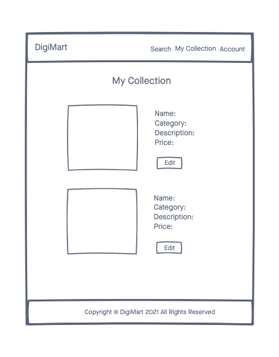
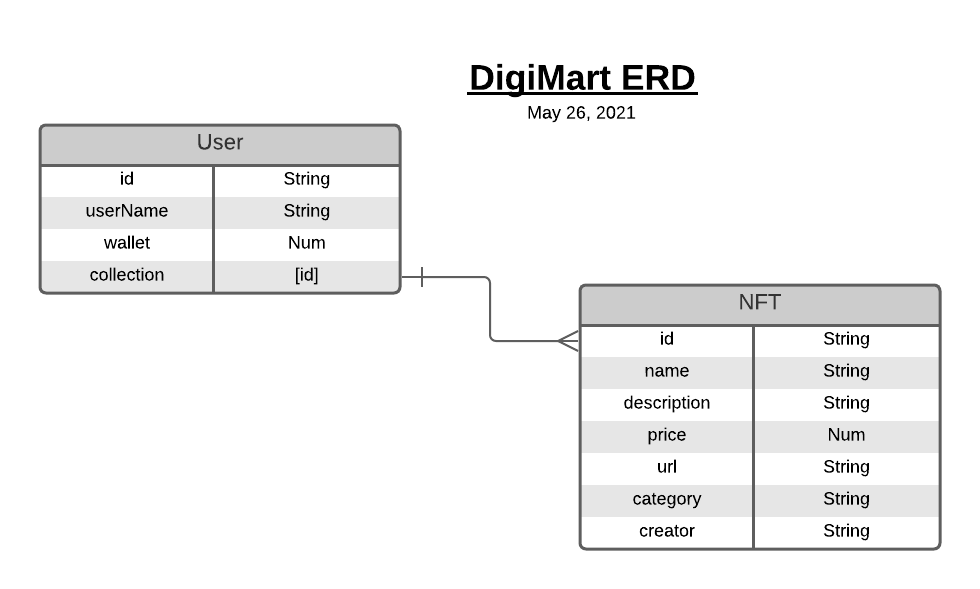
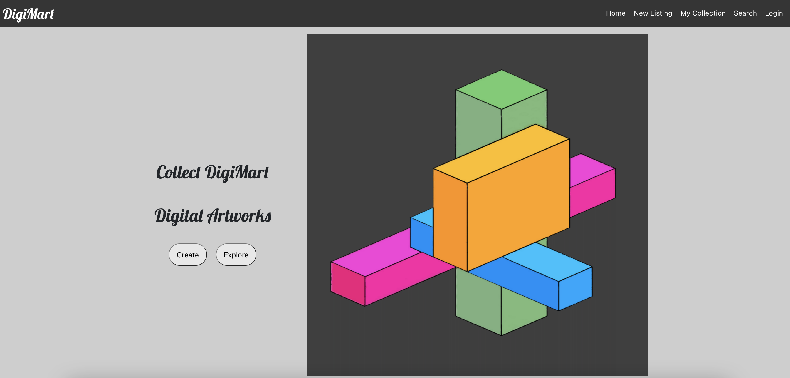
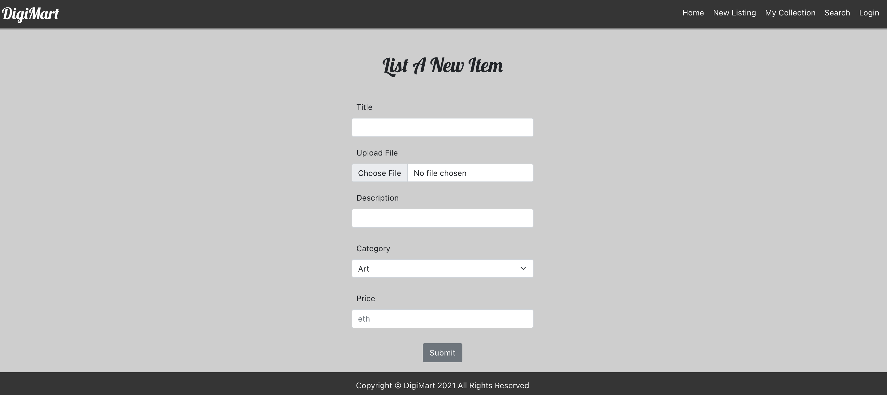
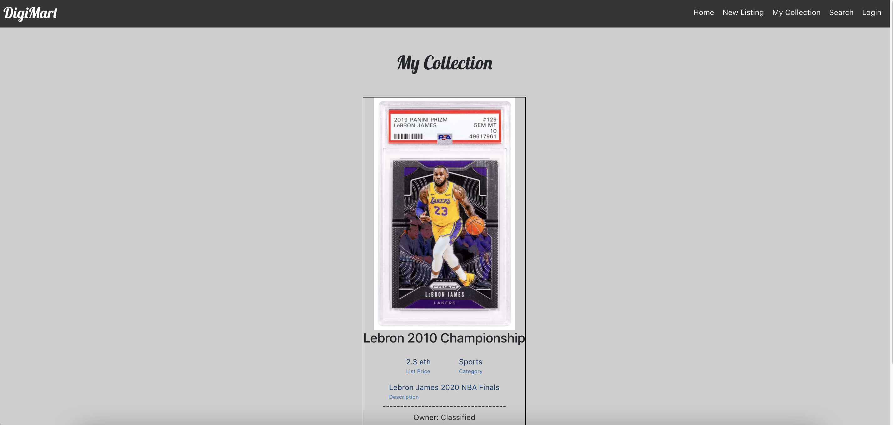

# DigiMart

A web marketplace for buying and selling NFT's (Non-Fungible Token) with Ether as the primary cryptocurrency.

## Technologies
- MongoDB
- Mongoose.js
- Express.js
- React.js
- Node.js
- Bootstrap CSS
- Google Firebase
- Cloudinary

## Initial Wireframes

## ERDs

## Screenshots

## Getting Started
[Click Here](https://digimart-app.netlify.app) to get started
[Click Here](https://github.com/jchoi192/digimart-backend) for the backend repository

## Unsolved Problems
- Users are unable to add more than one photo via Cloudinary

## Future Enhancements
- Allow users to go to a Marketplace where NFT's are available for purchase
- Allow users to add animations and video files
